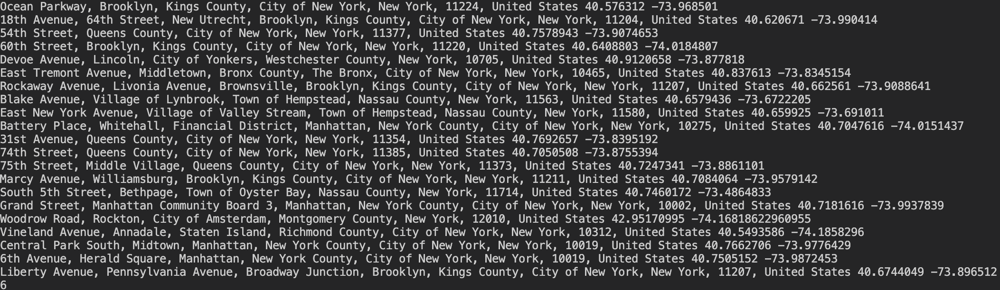

# Cubist Hackathon 

## Design Motivation

For more details on our system's design, see our [design doc](docs/system_design.md).

For more details on our mission statement, see our [mission statement doc](docs/mission_statement.md).

For more details on how to contribute to our project, see our [contributing guide](docs/CONTRIBUTING..md).

## Build 

```bash
chmod +x build.sh
./build.sh
```

## Run Tests

```bash
pipenv run python -m unittest discover -s tests
```

## Run Service

```bash
pipenv run python main.py
```
After starting the service, open [local host](http://0.0.0.0:8080) to access the web interface.

## LLM Driven Signal 
<p align="center">
  
</p>
