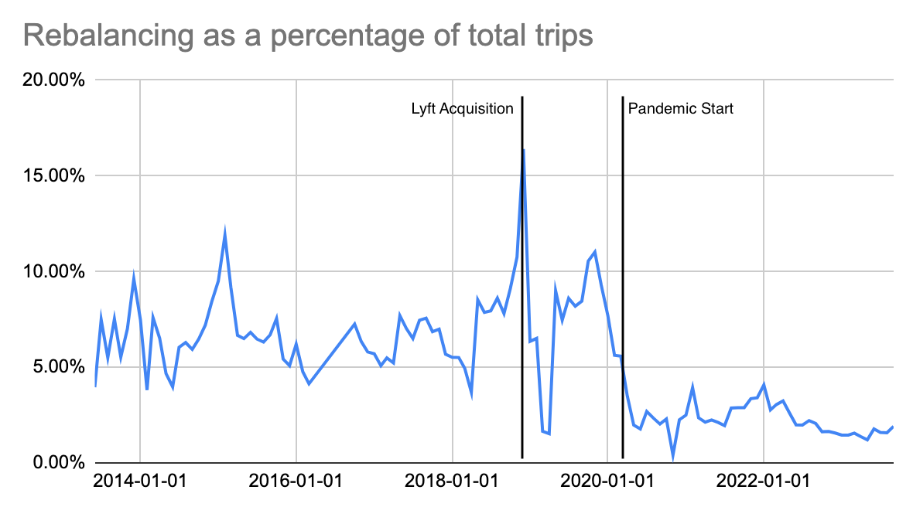
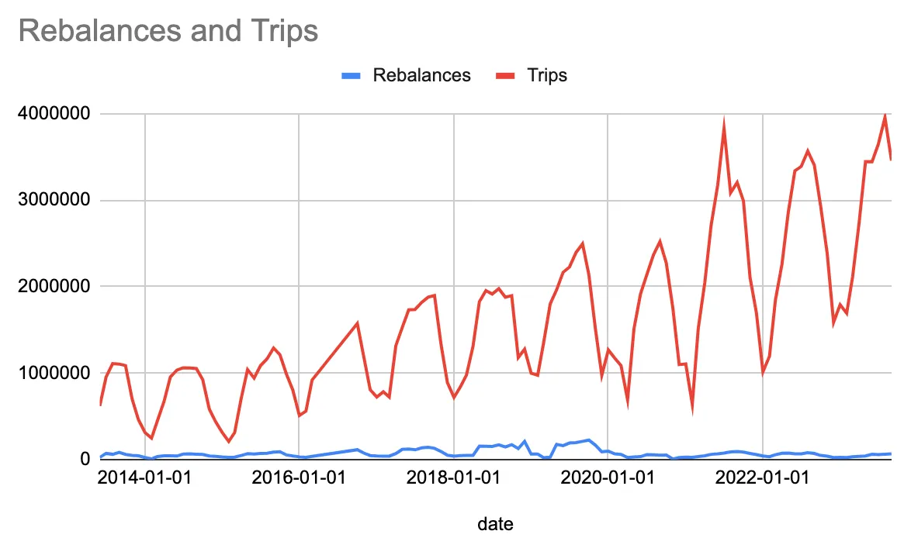
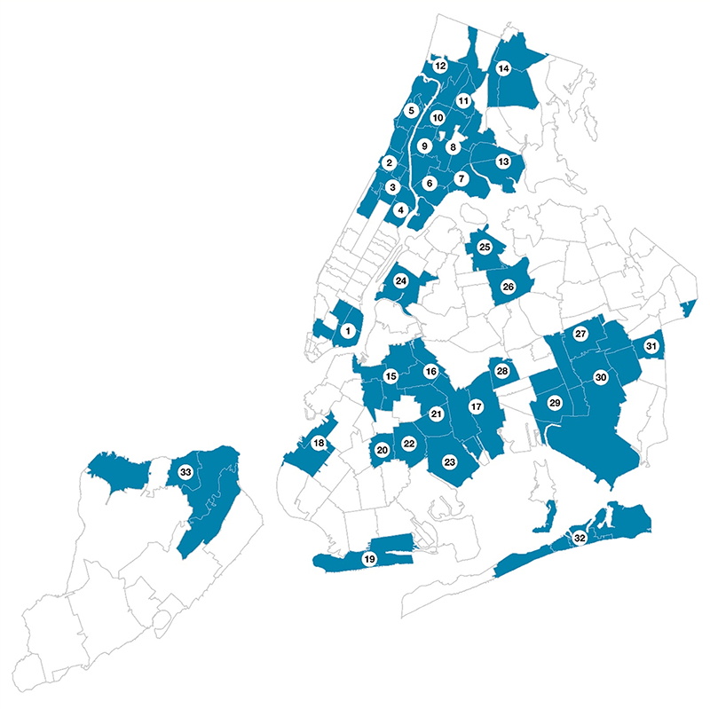
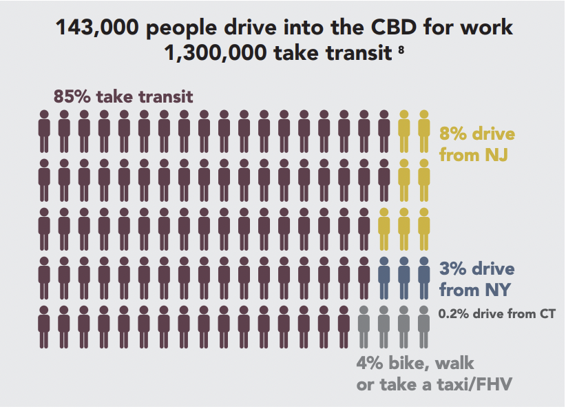
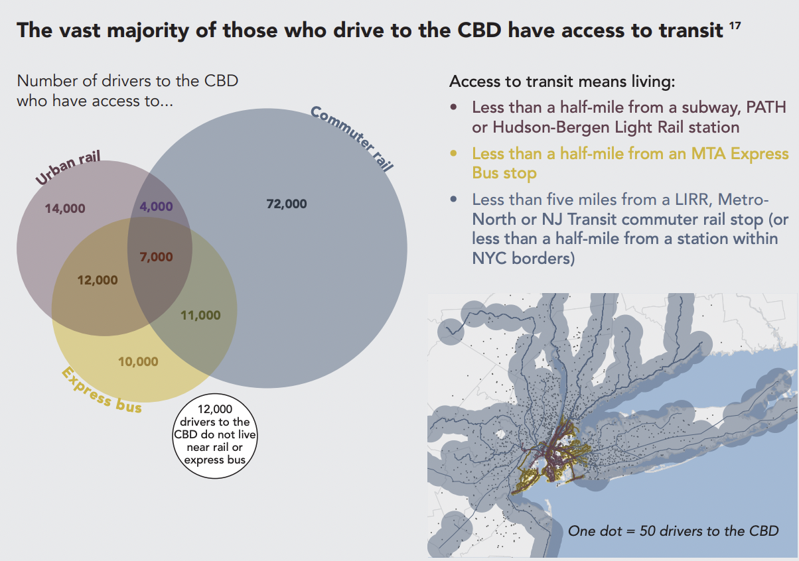

## Overview

We have created a high performant rebalancing algorithm that takes streaming data as input, forms a graph, and highlights optimal routes to restock/rebalance under resourced nodes in the graph. 

As a MVP, our rebalancing algorithm provides routes to minimize under-stocking and bolster equitable access to Citibikes across New York City. This algorithm can be repurposed for many types of distribution problems, especially of shared/limited resources (e.g. clothing, food, and services).

In construction of our algorithm, we considered and want to highlight a few ethical considerations-- mainly the disparity between access to equitable transportation in low-income neighborhoods, lack of proper distribution of resources, and the current inability for New York City to quickly adapt the availability of bikes to demand.

## The Problem

  
  

[The Fall of CitiBike Rebalancing](https://seanyc.substack.com/p/the-fall-of-citibike-rebalancing)

- In many neighborhoods, Lyft has failed to ensure the availability of bikes
- Neighborhoods on the peripheries of the system experience far more unusable stations, disproportionately affecting Black, Latino, and low-income residents.
- Riders in the Bronx experienced higher rates of unusable stations compared to other boroughs.
- Though ridership is at an all-time high, system expansion has outpaced ridership growth. 
- Despite numerous instances of service failures, New York City does not enforce the performance standards in Lyft’s contract.

[NYC Controller Office](https://comptroller.nyc.gov/reports/riding-forward-overhauling-citi-bikes-contract-for-better-more-equitable-service/)

## Mission Statement

To address the disproportionate impact of Black & Brown communities during the COVID-19 Pandemic, New York City launched the Taskforce on Racial Inclusion & Equity (TRIE). Through analysis of key indicators (health, socioeconomic, etc.), dialogue, and partnerships with other departments, TRIE identified [**33 priority neighborhoods of focus**](https://www.nyc.gov/site/trie/about/neighborhoods.page). These zipcodes also have limited access to many basic needs (e.g. healthy food options, proper education, and `equitable transportation`). 

    

<!--  -->

*"Equity in transportation seeks fairness in mobility and accessibility to meet the needs of all community members. A central goal of transportation is to facilitate social and economic opportunities by providing equitable levels of access to affordable and reliable transportation options based on the needs of the populations being served, particularly populations that are traditionally underserved. Under Executive Order 13985 Advancing Racial Equity and Support for Underserved Communities (2021), the term “equity” means the consistent and systematic fair, just, and impartial treatment of all individuals, including individuals who belong to underserved communities that have been denied such treatment, such as Black, Latino, and ... persons otherwise adversely affected by persistent poverty or inequality."* [US Dept Transportation](https://www.planning.dot.gov/planning/topic_transportationequity.aspx)

Our project addresses the lack of `equitable public transportation` in these predominantly underresourced communities. Some areas, particularly outer regions of Brooklyn and Queens, have minimal train coverage and primarily rely on bus routes. However, when there are no reliable buses to service an area, the only mode of transportation would be financially strenuous on the already underprivileged residents-- ubering or driving a car. Our rebalancing algorithm provides routes to minimize under-stocking and bolster equitable access across New York City.

## Considerations

### Congestion Pricing

On June 30, 2024, to alleviate traffic in NYC, most passenger vehicles will be charged $15/day for entering the Manhattan Central Business District `(CBD) congestion zone` below 60th Street and raising Taxi/Uber/Lyft fares ~$1.25-2.50+/ride. Congestion pricing is expected to lower the number of vehicles by 17 percent [November 2023 report by the MTA](https://new.mta.info/document/127761) `generate $15B` for capital projects that increase sustainability and `improve public transit`, as well as limit congestion and air pollution.

  
  

This figure on the left showcases that roughly 4% of daily commuters walk, bike, or take a taxi. In anticipated demand for Citibikes, our algorithm provides an `adaptive solution` to `distribute bikes` throughout these new hot zones. We will also be targeting maintaining availability for the 12,000 commuters that have low proximity to public transportation. 

### Construction Events

Construction events such as the [6 week G train shutdown to computerize the signal system](https://abc7ny.com/g-train-shutdown-commute-mta/14329870/) will further restrict the mobility of residents in Greenpoint. Without the G train, Greenpoint and surrounding regions risk becoming a transit desert, negatively impacting the local economy. The MTA's poor planning during the construction of the L-train leaves residents worried amidst pressure from the incoming congestion pricing as well. 

### Signal Alerts

Similar to construction events, there are live events that can boost the immediate demand for bikes/other forms of transportation. To handle alerts, (e.g. temporary denial of service at a train station) our algorithm increases the weight for demand on nodes in immediate proximity to affected areas. 
