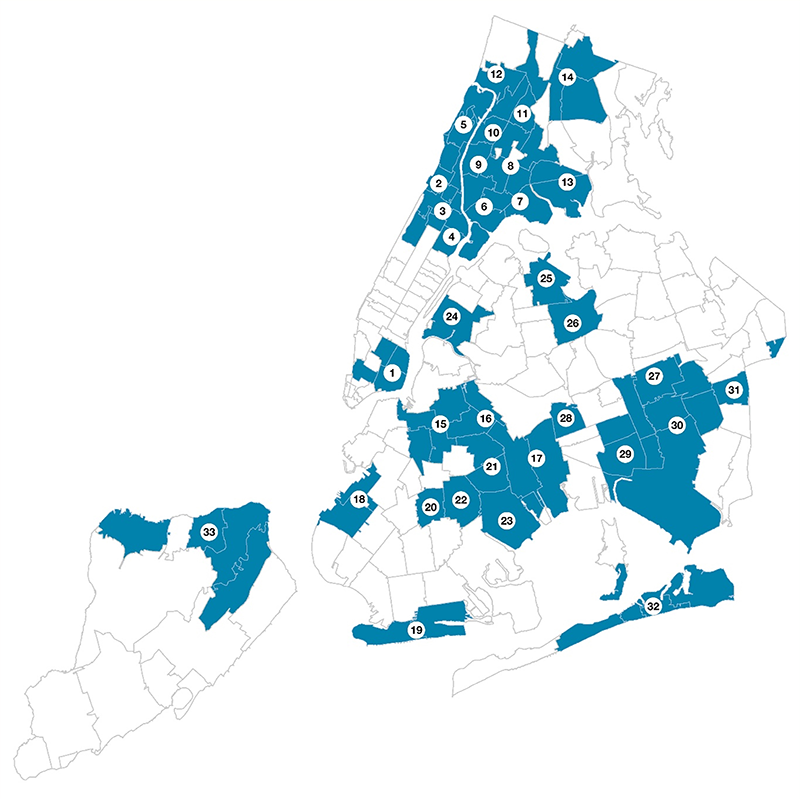
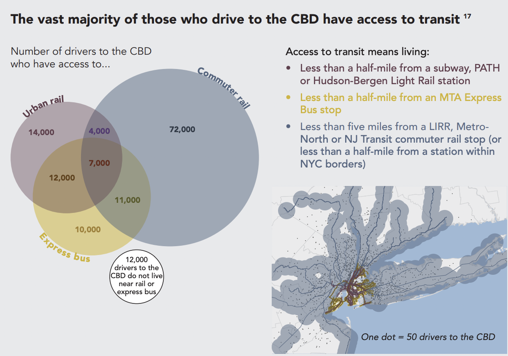

## Overview

We have created a high performant rebalancing algorithm which takes streaming data as input -> forms a graph -> highlights optimal routes to restock/rebalance under resourced nodes in the graph.

As a MVP we demonstrated the efficacy of this algorithm using #/capacity of citi bikes at stations. x

use our algo for other problems that can be used as a graph
very transferrable idea for multiple transportation / rebalancing problems (i.e. other income disparity things)

Our rebalancing algorithm provides routes to optimally distribute Citibikes and bolster equitable access in all locations.

Maintain a level of availability that does not disparage overall usefulness

Each TRIE Neighborhood will have direct ongoing contact and engagement with local residents and stakeholders to collectively identify shared resources, assets, needs, and priorities; strengthen COVID-19 recovery and resilience by sharing timely information and assisting in developing hyperlocal plans and ultimately strengthen community cohesion. TRIE Neighborhoods will have City agency staff and officials available to them to share City resources and facilitate connections to existing City-funded coalitions in their neighborhood.

show how our generalization can be repurposed for other shared resources. 

## Mission Statement

To address the disproportionate impact of Black & Brown communities during the COVID-19 Pandemic, New York City launched the Taskforce on Racial Inclusion & Equity (TRIE). Through analysis of key indicators (health, socioeconomic, etc.), dialogue, and partnerships with other departments, TRIE identified [**33 priority neighborhoods of focus**](https://www.nyc.gov/site/trie/about/neighborhoods.page). These zipcodes also have limited access to many basic needs (e.g. healthy food options, proper education, and `equitable transportation`). 

    

<!--  -->

*"Equity in transportation seeks fairness in mobility and accessibility to meet the needs of all community members. A central goal of transportation is to facilitate social and economic opportunities by providing equitable levels of access to affordable and reliable transportation options based on the needs of the populations being served, particularly populations that are traditionally underserved. Under Executive Order 13985 Advancing Racial Equity and Support for Underserved Communities (2021), the term “equity” means the consistent and systematic fair, just, and impartial treatment of all individuals, including individuals who belong to underserved communities that have been denied such treatment, such as Black, Latino, and ... persons otherwise adversely affected by persistent poverty or inequality."* [US Dept Transportation](https://www.planning.dot.gov/planning/topic_transportationequity.aspx)

Our project addresses the lack of `equitable public transportation` in these predominantly underresourced communities. Some areas, particularly outer regions of Brooklyn and Queens, have minimal train coverage and primarily rely on bus routes. However, when there are no reliable buses to service an area, the only mode of transportation would be financially strenuous on the already underprivileged residents-- ubering or driving a car. Our rebalancing algorithm provides routes to optimally distribute Citibikes and bolster equitable access in all locations.

## Considerations

### Congestion Pricing

On June 30th, to alleviate traffic in NYC, most passenger vehicles will be charged $15/day for entering the Manhattan Central Business District `(CBD) congestion zone` below 60th Street and raising Taxi/Uber/Lyft fares ~$1.25-2.50+/ride. Congestion pricing is expected to lower the number of vehicles by 17 percent [November 2023 report by the MTA](https://new.mta.info/document/127761) and aims to reduce congestion, air pollution, and `generate $15B` for capital projects that increase sustainability and `improve public transit`. 

<!--  -->

  
  

This figure on the left outlines that roughly 4% of daily commuters walk, bike, or take a taxi. In anticipated demand for citibikes, our algorithm would provide an `adaptive solution` to `distribute bikes` throughout these new hot zones. We will also be targeting maintaining availability for the 12,000 commuters that have limited proximity to public transportation. 

### Construction Events

Construction events such as the [6 week G train shutdown to computerize the signal system](https://abc7ny.com/g-train-shutdown-commute-mta/14329870/) will further limit the mobility of residents in Greenpoint. Without the G train, Greenpoint and surrounding regions risk becoming a transit desert which will also negatively impact the local economy. The MTA's poor planning during the construction of the L-train leave residents in worry amidst pressure from the incoming congestion pricing as well. 

### Signal Alerts

- Eric Adams congestion rates
- G train construction
- Dynamic Service alerts

## Generalization